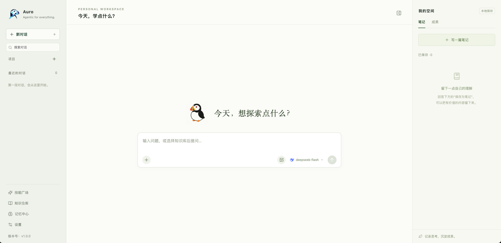
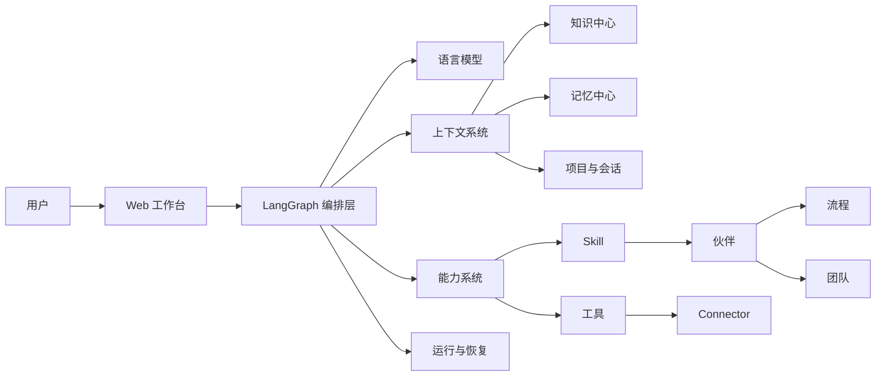

# Auro

**Agentic for everything.**

一个面向个人学习与工作的本地优先 AI Agent 工作台。

[English](README.md) · **简体中文**



### 项目理念

> **每个人都应该有属于自己的 Agentic 学习和工作工具。**
>
> **万物皆可进化，具备 Agentic 能力。**

Auro 希望把 AI 从一次性问答工具，逐步建设成真正理解个人资料、记忆、习惯和工作方式的长期协作伙伴。

这里的 **Agentic** 不只是“接入一个大模型”。它意味着系统能够围绕目标组织上下文，选择模型和工具，检索知识，利用长期记忆，执行可复用的技能与流程，并在边界清晰的前提下持续完成任务。

Auro 因此不追求堆叠零散功能，而是建设一套可以长期演进的个人 Agent 基础设施：

- 让每个人拥有可配置、可积累、可掌控的个人智能工作台；
- 让资料、工具、技能、流程和伙伴逐步具备可调用、可组合的 Agentic 能力；
- 让系统在持续使用中积累知识与记忆，同时保留人的选择权和控制权；
- 让非专业开发者也能借助 AI Coding 和生态工具继续扩展自己的工作台。

### 建设逻辑

Auro 采用“模型、上下文、能力与执行”分层设计。对话是统一入口，知识、记忆和项目上下文为 Agent 提供理解能力，工具、Skill、伙伴、流程与团队提供行动能力，LangGraph 负责把这些能力组织成可恢复、可观察的运行过程。



这套结构遵循几个原则：

1. **本地优先**：会话、知识库索引、记忆和设置默认保存在本机，个人数据由用户掌控。
2. **引擎可切换、可扩展**：知识与记忆通过边界清晰的独立引擎组织。切换引擎时，切换的是相应的完整工作逻辑；也可以在不改动工作台其他模块的情况下接入新的引擎。
3. **能力可组合**：工具解决单个动作，Skill 封装可复用方法，伙伴承载角色与能力，流程和团队负责更复杂的协作。
4. **执行可恢复**：长任务具备状态、预算、停止与继续机制，减少中断后从头开始的成本。
5. **过程可理解**：界面呈现必要的运行进度、工具调用、来源和结果，让用户能够判断 Agent 做了什么。
6. **扩展有边界**：模型、工具、Connector 和 Skill 都通过配置、权限与运行约束接入，避免能力扩展失去控制。

### 当前建设情况

Auro 目前处于持续迭代阶段，已经形成可以运行的个人工作台主干。

| 模块 | 当前实现 |
| --- | --- |
| 对话与项目 | 项目化会话管理、多模型选择、附件、消息复制与编辑、停止和继续任务 |
| Agent 编排 | 基于 LangGraph 的状态编排、工具路由、上下文预算、长对话压缩与运行恢复 |
| 模型配置 | 对话模型与 Embedding 模型分开配置，支持多个兼容供应商和本地模型服务 |
| 知识中心 | 本地文档知识库、多知识库联合检索、LlamaIndex 向量/混合检索、PageIndex OSS 文档树检索 |
| 记忆中心 | LangMem 与 Mem0 OSS 两套独立记忆方案；支持记忆空间、分层查看、编辑和管理 |
| 技能系统 | Skill 安装、版本快照、自动/手动触发、有上限的多 Skill 组合及运行前检查 |
| 伙伴与协作 | 助手、流程和团队能力；支持固定流程、动态规划、并发执行和任务恢复 |
| 工具与连接器 | 本地文件、笔记、联网搜索、网页读取、论文搜索、终端工具与 MCP Connector |
| 可观察性 | 任务进度、工具调用、引用来源、Token、耗时和费用信息的统一呈现 |
| Web 界面 | React + TypeScript 构建的对话、知识、记忆、技能和设置工作台 |

### 核心优势

#### 1. 面向个人长期使用

Auro 把项目、资料、知识库、记忆、模型和技能放在同一个工作台中。它关注的不是一次回答，而是如何让系统在长期学习和工作中逐渐形成个人上下文。

#### 2. 知识与记忆分工清晰

- **知识中心**管理用户主动导入、可以追溯来源的资料；
- **记忆中心**管理从持续交互中形成的个人信息、经历和方法；
- **会话上下文**负责当前任务的即时状态。

三者分别维护，又在编排层按任务需要组合，减少上下文混乱和无边界注入。

#### 3. 两套完整的记忆工作方式

目前集成了 LangMem 和 Mem0 OSS 两套相互独立的记忆引擎。每个引擎保留自己的空间、结构、写入、更新和召回逻辑，用户可以根据需要切换，并决定是否继续使用该引擎原有的记忆空间。

这两套引擎是当前实现，而不是架构上限。记忆层通过可扩展的引擎接口组织，可以根据个人的使用场景、存储方式和召回策略继续接入其他记忆引擎。

#### 4. 双知识引擎

- **LlamaIndex**：适合本地分块、向量检索以及可选的 BM25 混合检索；
- **PageIndex OSS**：适合依据文档目录与页面结构建立树状索引。

Auro 同样不限定只能使用这两套知识引擎。知识层将文档导入、索引、检索和配置封装在可扩展的引擎边界内，可以根据个人资料类型和检索需求继续接入其他知识引擎。

对话可以不选择知识库，也可以同时选择多个已建立的知识库。

#### 5. 从工具到团队的能力层级

Auro 将能力逐层组织为工具、Skill、伙伴、流程和团队。简单任务可以直接调用工具，稳定方法可以沉淀为 Skill，复杂目标则可以交给流程或多伙伴团队完成。

#### 6. 适合继续开发

后端以 Python 模块划分领域能力，前端使用 React 与 TypeScript，模型、知识、记忆、工具、Skill 和 Connector 都保留独立边界，便于在不推翻主干的情况下继续替换或增加实现。

#### 7. 本地优先且保留安全边界

个人数据默认留在本地；Skill 安装包含元数据、依赖与安全检查；脚本和终端能力通过权限策略和运行约束控制。使用外部模型、联网工具或 Connector 时，只向用户配置的服务发送完成任务所需的数据。

### 环境要求

- macOS 或 Linux
- Python 3.12
- [uv](https://docs.astral.sh/uv/)
- Node.js 20 或更高版本
- 可选：[Ollama](https://ollama.com/) 本地 Embedding 模型

### 快速开始

```bash
git clone <repository-url> Auro_agent
cd Auro_agent

cp .env.example .env
uv sync --locked

cd frontend
npm ci
npm run build
cd ..
```

在 `.env` 中填写需要的模型密钥，或者在启动后通过“设置”页面添加模型配置。不要把包含密钥的 `.env` 提交到 Git。

启动服务：

```bash
uv run --locked workbench web
```

首次使用时，可以按下面的顺序完成基础配置：

1. 在“设置”中配置语言模型和 Embedding 模型；
2. 在“知识中心”创建知识库并添加本地文档；
3. 在“记忆中心”选择记忆引擎并检查默认记忆空间；
4. 在“技能广场”启用所需 Skill 或配置 Connector；
5. 回到对话页，选择模型和可选知识库后开始任务。

### 项目结构

```text
Auro_agent/
├── src/personal_workbench/   Python 后端、LangGraph 编排和领域模块
├── frontend/                 React + TypeScript Web 界面
├── bundled/skills/           随项目提供的第一方 Skill
├── images/                   README 与项目展示图片
├── notes/                    本地资料目录（个人内容不提交）
├── pyproject.toml            Python 项目和依赖配置
├── uv.lock                   Python 锁定依赖
└── .env.example              环境变量示例
```

### 数据与隐私

“本地优先”表示 Auro 默认在本机保存和组织个人数据。调用云端语言模型、联网搜索或外部 Connector 时，相应请求仍会发送到用户选择的服务，请根据自己的隐私要求配置供应商与权限。

### 当前边界

- 项目仍在积极开发，数据结构和部分接口可能继续调整；
- 知识中心当前以本地文档为主，更多远程资料来源尚待扩展；
- 外部模型、搜索和 Connector 的可用性取决于相应服务、账号与网络；
- Skill 脚本执行已设置权限和运行约束，但仍应只安装可信来源的 Skill；
- 当前更适合作为个人工作台和可继续开发的基础项目，尚未以多人生产部署为主要目标。

### 致谢

感谢 [LangGraph](https://github.com/langchain-ai/langgraph)、[LlamaIndex](https://github.com/run-llama/llama_index)、[PageIndex](https://github.com/VectifyAI/PageIndex)、[LangMem](https://github.com/langchain-ai/langmem)、[Mem0](https://github.com/mem0ai/mem0) 及相关开源社区。
